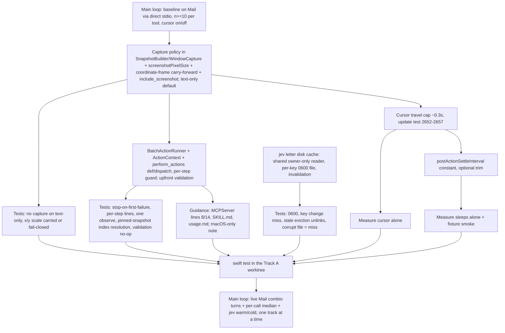

# Track A (PR A: speed): brainstorm of design options

Scope is locked by outcome-lock.md decisions 1–6 and 11. The options below differ only in how each decision is built. Every source claim was read at HEAD `afb60fa`, in the main checkout, read-only.

## 1. Problem, restated with evidence

A Mail step takes about 9s. The server's share is about 3–3.5s (evidence report). The source splits that time as follows.

| Cost per click on Mail | Source | Size |
|---|---|---|
| Cursor travel, blocking | `SoftwareCursorOverlay.animateMove` :348-392 runs through `performOnMain` → `DispatchQueue.main.sync` (:19). The duration is `calibratedTravelDuration`, which always returns `closeEnoughTime` (CursorMotionModel.swift:493-494, :657-658). Test :2639 pins it at **1.429s**, whatever the distance. | ~1.43s |
| Click pulse | `animateClickPulse` 0.16s per click (SoftwareCursorOverlay.swift:555) | 0.16s |
| Settle sleep after AX click | ComputerUseService.swift:1140-1205 (0.15s, repeated about 12 times in the file) | 0.15s |
| Post-action `refreshSnapshot`: full AX walk plus capture plus PNG encode | :773-779 → `SnapshotBuilder.build` → `WindowCapture.resolve` → `captureImage` (AccessibilitySnapshot.swift:638-661). The PNG encode loop is at :393 and :721-751. | ~1.4–1.6s (direct stdio get_app_state on Mail) |

The components add up to about 3.1–3.3s, which matches the measured 3–3.5s.

### Assumptions I am challenging

1. **Decision 5's "skip the redundant pre-action snapshot" is already true.** `currentSnapshot` returns the cached snapshot with no freshness check (ComputerUseService.swift:961-967). The cache survives across calls: each socket connection holds one `StdioMCPServer` (MacOSAppAgentProxy.swift:374), and that server holds one service (MCPServer.swift:38-43). So in steady state the pre-action snapshot is a free cache hit.
   - The real waste is the **post-action** refresh on every step, which the batch removes.
   - Do NOT add a TTL or freshness check. It would add rebuilds, not remove them.
   - Deliverable for this item: one measurement that confirms the hit costs nothing, and no code change.
2. **Screenshots are not the main server cost.** The Finder get_app_state, capture included, takes 0.12–0.16s, so on Mail the capture plus encode is probably 0.1–0.5s (not measured). The screenshot's main cost is on the agent side: 290–356 KB per result. **The cursor is the largest server cost (1.43s).**
3. **Skipping capture is not free, because it breaks coordinate clicks.**
   - x/y clicks are scaled by the pixel size of the cached snapshot's PNG (ComputerUseService.swift:1785-1807).
   - With no PNG, `screenshotPixelScale` falls back to 1×1 (:236-245).
   - So after a text-only action, an x/y click read from an earlier 2× screenshot would land at double the intended coordinates. The live run already had a coordinate click hit "New Message" (test-260929-1720 §Problems 3).
   - Every proposal must carry the coordinate frame forward, or fail closed.
4. **The obvious DRY reuse is wrong.** The CLI `--calls` runner (ComputerUseToolDispatcher.swift:344-366) refreshes after every step. Indices are renumbered between steps, so from step 2 onward an index resolves against a state the agent never saw. This rules out Proposal D.
5. **The jev disk cache alone may never fill in production.** It helps only "after the first success". Under GPU load, 22 of 27 sequential `/tokenize` calls used up the 12s deadline (test report :11-12, :46-48), so the first success may never arrive. This is flagged as an open question, with a contingency that stays inside the locked transport.

## 2. Constraints (fixed)

- The server never plans (memory `mcp-server-never-owns-a-goal`). The batch runs exactly the steps it is given.
- The batch allows only these actions: click, type_text, press_key, set_value, scroll, perform_secondary_action. `drag` is not on the locked list.
- Action results are text-only by default. A screenshot comes back on request, or when the AX tree is empty. A text-only build must also skip the SCScreenshotManager capture (decision 11). `get_app_state` is unchanged.
- jev: the letter table is persisted per (base_url, model) in the 0600 config dir. Each request still uses its own ephemeral session, with no keep-alive.
- Every fast-path change needs its own measurement.
- Guidance: stop calling get_app_state after every action, and teach batching.
- Track isolation: shared files (ToolDefinitions, the dispatcher, MCPServer instructions, SKILL.md/usage.md, the tool-count test) are append-only in Track A's own region. Track B owns the "Avoid falling back to AppleScript" line (MCPServer.swift:16), so A must leave it byte-identical.
- Go runtimes are a non-goal. The docs must say `perform_actions` is macOS-only, because SKILL.md:14-16 currently claims the same tool surface on all three platforms.

## 3. Proposals

### Proposal A: thin batch runner plus an observation policy (recommended)

**Design.** The existing action methods gain one internal parameter, an `ActionObservation`:

- `.none`: no refresh. Used for intermediate batch steps.
- `.text(capture:)`: the new default for single actions.

A new `BatchActionRunner` works in three stages:

1. It parses and validates **every** step before any step runs, using the dispatcher's existing argument helpers.
2. It takes the app's cached snapshot once and passes it explicitly to every step.
3. It runs the steps with `.none` and stops at the first thrown error. It then builds one final text snapshot.

Capture becomes a build policy, `SnapshotCapturePolicy { always, never, whenTreeEmpty }`, applied in `WindowCapture.resolve` so that `captureImage` is never called when capture is off.

**File-level change sketch**

- `ComputerUseService.swift`
  - The six action methods (:595-959) take an `ActionContext`: an optional pinned snapshot plus the observation.
  - The 20-odd tails of the form `snapshotResult(for: try refreshSnapshot(...), style: .actionResult)` collapse into one `finishAction(query:context:recoveryPolicy:)`.
  - `refreshSnapshot` gets a `capture:` argument.
  - A new `lastScreenshotFrame[key]` holds `(pixelSize, windowBounds)`. `screenshotPixelSize(snapshot:)` (:1793) uses it when the snapshot has no PNG. If the window size has changed since then, the call throws "coordinates need a fresh screenshot" instead of silently using scale 1.
  - `decideNextAction` (:507) builds with `.never`, because it only reads text. This helps the ≤3s warm target.
- `AccessibilitySnapshot.swift`
  - `SnapshotBuilder.build(..., capture:)` and `WindowCapture.resolve(..., captureImage: Bool)` (:600-641).
  - For `whenTreeEmpty`, capture runs after the walk, only if `records.isEmpty`.
  - The `.always` path, used by get_app_state, keeps today's order (capture, then walk), so get_app_state output is unchanged.
  - `AppSnapshot` gains `screenshotPixelSize`.
- New `BatchActionRunner.swift` (~150 LOC)
  - The `ActionStep` enum and its parse/validate.
  - A run loop that takes `perform` and `observe` closures, which gives unit tests a seam that needs no live AX.
  - `MacSessionGuard.requireUnlocked` runs per step, so a batch stops if the Mac locks mid-run.
- `ToolDefinitions.swift`: add `perform_actions` to `all`, not `listed`. That keeps the `listed.count > all.count` check at MCPServer.swift:26 correct. Add `include_screenshot` to the six action schemas.
- `ComputerUseToolDispatcher.swift`: one new case in `callTool` (:62-130).
- `SoftwareCursorOverlay.swift` and `CursorMotionModel.swift`: travel duration becomes `min(closeEnoughTime, visualCursorTravelDuration)`, default about 0.3s. `animateMove` already time-scales the spring (`springTime = normalizedElapsed * springTargetDuration`, :366-368), so the motion keeps its shape and only compresses. Test :2639 stays. Test :2652-2657 is rewritten to assert the cap.
- Sleeps: the repeated 0.15s literals become one `postActionSettleInterval` constant. Change its value only if the fixture smoke suite stays green, and measure the change separately.
- `DecisionJevPrompt.swift`: the resolver checks memory, then disk, then network (see §4). `DecisionRemoteBackend.swift`: `readValidated` (:128-180) is generalized to an internal `readOwnerOnlyRegularFile(path:maxBytes:)` (DRY).
- `MCPServer.swift` instructions and skill docs: see §5.

**Tool contract**

```json
{"name":"perform_actions","inputSchema":{"type":"object","additionalProperties":false,
 "required":["app","actions"],
 "properties":{
  "app":{"type":"string"},
  "actions":{"type":"array","minItems":1,"maxItems":10,"items":{"type":"object","required":["tool","args"],
    "properties":{"tool":{"enum":["click","type_text","press_key","set_value","scroll","perform_secondary_action"]},
                  "args":{"type":"object","description":"same args as the single tool, without app"}}}},
  "include_screenshot":{"type":"boolean","default":false}}}}
```

The step format is `{tool, args}`, the same shape as the CLI `--calls` format (usage.md:55-69), so the agent learns one shape. There is one `app` per batch, because indices belong to one app's snapshot.

Result, as text:

```
Step 1 click element_index=12: ok
Step 2 type_text: ok
Step 3 press_key key=Return: failed: <error>
Step 4 click element_index=40: not run
<final state, actionResult style, text only>
```

- `isError` is true if a step failed.
- If validation fails, no step runs, no snapshot is built, and the call returns an error.
- Index rule: every `element_index` in a batch refers to the state the agent last received for that app. If step 1 opens a menu, a menu-item index from that menu is unknown, so the step fails cleanly and the final state shows the menu.

**Pros**
- Smallest diff that meets every acceptance criterion.
- Single-action behaviour stays the same apart from dropping the screenshot.
- Batch semantics come out naturally, because the cache is simply not refreshed between steps.
- Upfront validation means a typo in step 4 cannot leave a half-run batch.
- The closure seam lets unit tests cover stop-on-failure, per-step results and single-snapshot resolution without the fixture app. `AppDiscovery.resolve` needs a running app (AppDiscovery.swift:144), so the seam matters.

**Cons**
- The action methods gain a parameter.
- The fixture branches (:617-645 and others) also need the context passed through.
- Click fallbacks against a pinned snapshot use stale frames. `performAXClickSequence` hit-tests at `clickActionPoints` (:1162-1190), so if step 1 moved the layout, a later step's fallback could hit a different element.

**Risk: medium.** Mitigation: before a coordinate fallback in a pinned batch step, re-read the element's live `AXFrame` (one attribute read), or end the batch there.

**Acceptance mapping**
- Turns 18→≤9: one batch replaces "click field, type, Return" (3 turns), and the guidance removes the per-action get_app_state. Must be measured live by the main loop.
- Server time down ≥30%:
  - click/set_value: estimated 3.2s → about 1.9s (−40%), from the cursor cap plus no capture.
  - type_text/press_key: only about 10–20%.
  - Whether the median passes depends on the call mix (open question 1).
- jev warm ≤3s, cold after the first success: the disk cache, plus capture skipped in decide.
- swift test: runner tests (stop, per-step, index), a text-only default test (no PNG, and the capture function is not called), a coordinate-frame carry-forward test, and jev cache tests.

### Proposal B: split perform from observe, with each single action as a batch of one

**Design.** The action bodies (:595-959, about 365 LOC) are moved into `performStep(_ step: ActionStep, snapshot: AppSnapshot) throws -> StepOutcome`. This function has no refresh and no result. One `observe(app:capture:)` path builds the result. The public `click(...)` and the other five become `run(app:, steps:[step], capture:)`. `StepOutcome` carries per-step notes, generalizing the pattern of `appendingDragDeliveryNote` at :870.

**File-level change sketch**
- New `ActionStep.swift`: a typed enum parsed once.
- New `ComputerUseService+ActionSteps.swift`: the relocated action bodies.
- `ComputerUseService.swift` shrinks to wrappers plus `observe`.
- The dispatcher parses each action into a step and calls `run`.
- A protocol seam, `ActionStepPerforming`, for tests.
- Capture, coordinate frame, cursor, sleeps, jev and guidance are the same as in A.

**Tool contract:** the same as A.

**Pros**
- One code path serves single actions and batches (strong DRY).
- Batch tests automatically cover the single tools.
- Each step takes its snapshot explicitly, so index-resolution tests are straightforward.
- It moves the 2074-line file toward the 200-line module guidance.

**Cons**
- A large diff in the most fragile code: the click fallback chain, the Stage Manager activation path (:889-899) and the fixture branches.
- Reviewers must confirm there is no behaviour change across roughly 365 moved lines.
- It forces every single-action error path through a new wrapper.

**Risk: medium-high.** It turns a speed PR into a refactor PR. Rollback is all-or-nothing.

**Acceptance mapping:** the same as A. Test coverage is stronger. Delivery takes longer.

### Proposal C: state on demand, where actions return an acknowledgement and state is opt-in

**Design.**
- Actions skip the post-action AX walk by default. They return a per-step acknowledgement plus a cheap focused-element summary, which needs about 2 AX attribute reads.
- The full text state is built only when the call passes `return_state: true`. That is the default at the end of a batch and optional for single actions.
- The cache is marked stale but kept, so indices still resolve against the AXUIElement references the agent saw.

**File-level change sketch:** as in A, plus a `.ack` observation mode, a stale flag on the cached snapshot, and a new `return_state` argument on all six tools.

**Contract:** as in A, plus `return_state: boolean` (default false for single actions, true for batches).

**Pros**
- The largest server win: a single action drops to about 0.3–0.6s (−80% or more).
- The smallest payloads.

**Cons**
- It changes the action result contract that agents and the docs rely on: "Action tools return refreshed app state" (usage.md, Text Limits section) and "use the action result … to verify" (MCPServer.swift:14).
- Agents then need an extra get_app_state turn to verify, which works against the 18→≤9 turns goal.
- Stale indices pile up across several single actions.
- Decision 3 says results are "text-only", not "stateless". This option stretches the lock.

**Risk: high,** mostly behavioural (agent confusion and more turns), not code.

**Acceptance mapping:** it clears server −30% by a wide margin. The turns criterion is at risk. The rest is the same as A.

### Proposal D: expose the existing `--calls` sequence runner over MCP (rejected)

**Design:** `perform_actions` loops `dispatcher.callToolAsResult` over its steps, reusing ComputerUseToolDispatcher.swift:344-366, which already stops on the first error.

**Pros:** about 30 LOC, and full reuse.

**Cons, decisive:**
- Every step refreshes, so a 3-step batch still costs 3 AX walks, about 4.5s or more.
- Each refresh overwrites `snapshotsByApp` (:990-991), so indices from step 2 onward resolve against a renumbered tree the agent never saw. That can click the wrong element.
- It returns N states instead of one final state.

It fails the index-resolution test, decision 1's "one final state", and most of the speed goal. It is listed only because it is the tempting shortcut.

## 4. Component choices shared by A, B and C

**Cursor travel**

| Option | Effect | Verdict |
|---|---|---|
| (a) Cap the blocking travel at about 0.3s. The spring is time-scaled, so the path stays the same. | −1.1s per click or set_value. The visual still matches the click. | **Pick this.** |
| (b) Non-blocking travel (`async` on main) | −1.43s. The pulse can come after the real click. The main thread stays busy pumping frames (:795-797), and the next step's `main.sync` waits for it anyway. | Reject. |
| (c) Teleport on intermediate batch steps | Saves time only inside batches, not on single calls. | Not needed if (a) ships. |

Baseline for the cursor measurement: `OPEN_COMPUTER_USE_VISUAL_CURSOR=0` (SoftwareCursorOverlay.swift:27-33) already gives the upper bound with no new knob. OPEN_COMPUTER_USE_* variables pass the peer sanitizer (MacSessionGuard.swift:64-68).

**Fixed sleeps.** They are the lowest-value lever: at most 0.15s per action, about 5%. Trim only via the single named constant, and measure it on its own. Keep the settle sleeps between batch steps, because they are what lets step N+1 see step N's effect.

**jev letter disk cache**
- Location: `~/Library/Application Support/OpenComputerUse/decision-model/jev-letters/` (0700).
- One file per key: `<sha256(base_url|model)>.json`, mode 0600. One file per key, written by atomic rename, avoids a cross-process lost update: the Dev and release agents are separate processes (memory `app-agent-socket-eviction-between-bundles`).
- Content: `{version, base_url, model, sample_prompt_sha256, letters{A..Z:{id,token_str}}}`. It never contains api_key.
  - `sample_prompt_sha256` invalidates the file when the template changes. Today there is no version constant (scout §3), and `samplePrompt` is at DecisionJevPrompt.swift:145.
- Read: the shared owner-only reader (O_NOFOLLOW, fstat uid/mode/regular/size), then re-run the "26 distinct ids and token_strs" check from DecisionJevPrompt.swift:95-100. Any failure counts as a cache miss, never as a user-facing error.
- Write: only after a successful network resolve. Create a temp file with O_CREAT|O_EXCL|O_NOFOLLOW at 0600, then rename. Write errors are swallowed.
- Invalidation:
  - A different model or base_url is a different key, so it misses automatically.
  - `invalidateCache()` (:48-52) also unlinks the file, so a tokenizer redeploy is still caught through `staleLetterCacheMessages`.
- Test seam: the resolver gets `diskCacheDirectory: URL?`. Existing tests pass nil; new tests use a temp dir and assert mode 0600, a miss on a key change, and eviction on a stale message.

## 5. Guidance rewrite (decision 6)

**MCPServer.swift, lines :8 and :14 only**
- Replace "call `get_app_state` every turn" with: "Call get_app_state when you have no current state for the app. Action results already include the refreshed text state; do not call get_app_state after an action unless the result lacks what you need or you need a screenshot."
- Add a batching paragraph: use `perform_actions` for short sequences you can fully specify from the current state (for example, click a field, type, press Return). Put externally visible steps such as Send in their own call, after you confirm them.
- Coordinates come from the most recent screenshot you saw.
- Leave line :16 (AppleScript) for Track B.
- Update the constants that tests compare against: DecisionAdvisorTests :476/:507 and OpenComputerUseKitTests :625.

**SKILL.md**
- Core Workflow steps 5, 8 and 9: add batching, and note `include_screenshot`.
- Operating Rules: change the rule at :39 to "state from the latest get_app_state **or action result**".
- State that `perform_actions` is macOS-only.

**usage.md**
- Choosing Targets (:101-106): align with the new rules.
- Text Limits: note that action results are text-only by default.
- Add the Mail pattern that worked live: focus the field, then type_text, then Return.

## 6. Comparison

| Dimension | A (thin runner) | B (perform/observe split) | C (state on demand) | D (reuse --calls) |
|---|---|---|---|---|
| Estimated diff, excluding tests and docs | ~450 LOC | ~900 LOC (mostly moved) | ~550 LOC | ~120 LOC |
| Single click on Mail, server time (estimate) | ~1.9s (−40%) | ~1.9s | ~0.5s (−85%) | ~1.9s |
| 3-step batch (click, type, Return) | ~2.1s, 1 turn | ~2.1s, 1 turn | ~2.1s, 1 turn | ~4.5s+, 1 turn |
| Correct index resolution | yes (pinned snapshot) | yes (explicit) | yes, but stale across calls | **no** |
| Single-action contract change | screenshot only | screenshot only | state becomes opt-in | screenshot only |
| Testable without live AX | yes (closure seam) | yes (protocol seam) | yes | partly |
| Regression risk | medium | medium-high | high (agent behaviour) | high (wrong clicks) |
| Track B rebase friction | low (appends only) | medium (dispatcher rewritten) | low | low |
| Meets every acceptance criterion | likely; server median depends on the call mix | likely | turns at risk | no |

**Simplest viable option: A.** D is simpler, but it is not viable.

## 7. Recommendation

**Proposal A**, with two ideas borrowed from B: all steps are validated before any runs, and the pinned snapshot is passed explicitly to each step.

Why A:
- It meets decisions 1–6 and 11 with the smallest blast radius in the most fragile file.
- It keeps the single-action contract.
- It tests batch semantics without the fixture app.
- It leaves B's refactor as an optional follow-up once PR A's measurements are in.

C's extra speed is not worth the turn and verification regression, and it bends decision 3. D is incorrect.

Second-order effects of A:
- Agents lose the screenshot on actions, so vision-first agents must learn `include_screenshot`.
- A 0.3s cursor changes how the demo looks, which is user-visible.
- `decide_next_action` snapshots stop carrying a PNG, which is harmless once the coordinate frame is carried forward.
- The disk cache adds a new file under a trusted directory. Its trust level is the same as remote-backend.json: same user, 0600.

## 8. Plan



## 9. Unresolved questions

1. **Which server-time metric?** "Median per single action call" needs a fixed definition: server-side via direct stdio, or in-session. It also needs a fixed call mix. Clicks gain about 40%, type_text and press_key only about 10–20%. Permission review is already gone (decision 2), which alone cuts about 1.3s in-session.
2. **Can jev ever reach a first success?** Under the current GPU load, 27 sequential `/tokenize` calls within 12s may never complete, so the disk cache would never fill. Options within the lock:
   - bounded-concurrency `/tokenize` (still one ephemeral session per request);
   - keeping partial letter progress across calls;
   - giving letter resolution its own budget.
   The main loop should decide after a live check.
3. **Warm ≤3s** includes the Mail AX walk, about 1.3s, inside `decideNextAction` (:507). If the warm call measures above 3s, is it acceptable to run the operation and target completions concurrently? They are independent prompts (DecisionJevClient.swift readout).
4. **Default cursor cap: 0.3s or something else?** Should an env override exist for users who want the "official" slow travel?
5. **Batch maxItems:** 10 is proposed. Does the main loop want a different bound?
6. **Stale-frame fallback in pinned batch steps:** re-read the live AXFrame before coordinate fallbacks, or disable nearby hit-testing for steps after the first?
7. **Cross-track (main loop to relay to Track B):** Track B should not add conditionally listed tools through `listed()` without changing the cascade-guide check at MCPServer.swift:26 (`listed.count > all.count`). Otherwise the jev guide is appended when only `run_script` is listed.
