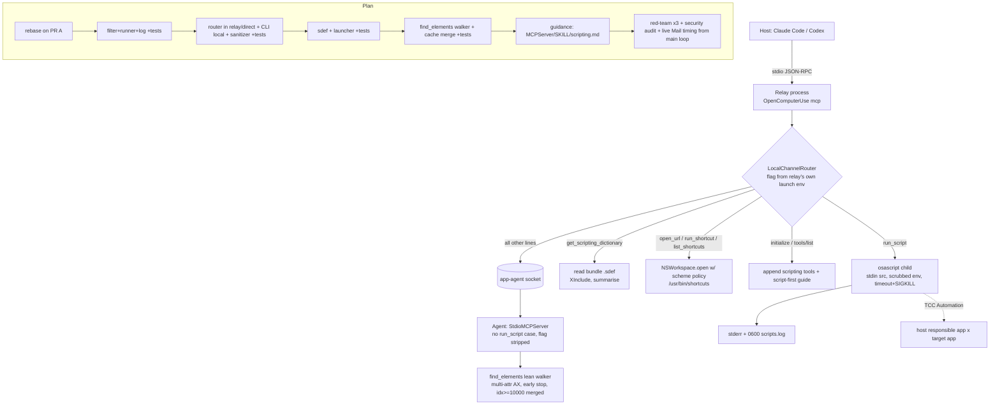

# Track B brainstorm: fast non-screenshot channels (PR B)

Scope: outcome-lock decisions 7–10. Every proposal delivers all four channels (run_script, the sdef lookup, find_elements, the Shortcuts/URL launcher) plus the script-first guidance. The proposals differ only in how they are built.

## 1. Problem and hard facts from source

**The "MCP server process" in the default install is only a relay. The agent runs the MCP server.**
- `OpenComputerUseMain.swift:36-38` proxies `.mcp` whenever the app bundle is present.
- `OpenComputerUseCLI.swift:32-36`: `.mcp` and `.call` both return `true`.
- `MacOSAppAgentProxy.swift:121-137` (`proxyMCP`) forwards every JSON-RPC line (initialize, tools/list, tools/call) to the agent.
- The agent owns the real `StdioMCPServer` (`MacOSAppAgentProxy.swift:365`) and answers from `:405-423`.
- **Consequence:** if run_script is added to `ToolDefinitions` and `ComputerUseToolDispatcher`, as the provisional change set in `pipeline-addendum-v2.md:10` implies, it would execute inside the agent. That breaks decision 8.
- Decision 8 needs code in the relay: `MacOSAppAgentProxy.swift`, plus `OpenComputerUseCLI.swift` and `MacSessionGuard.swift`. The change set does not list these files.

**The CLI path is a second route into the agent.**
- `open-computer-use call run_script` is proxied as `kind:"cli"`.
- The agent then calls `runOpenComputerUseCall` (`MacOSAppAgentProxy.swift:424-441`, `:489-490`).
- run_script must be absent from the Kit dispatcher, and `call run_script` must run locally or be refused.

**The flag would leak through the per-call environment.**
- `sanitizePeerEnvironment` keeps every `OPEN_COMPUTER_USE_*` key (`MacSessionGuard.swift:64-68`).
- A flag like `OPEN_COMPUTER_USE_ENABLE_SCRIPTING` would therefore reach the agent on each call.
- Listing is environment-driven (`ToolDefinitions.swift:178-183`, `MCPServer.swift:112-118`), so the flag must be stripped there as defense in depth.

**Whose TCC grant is used.**
- The agent is launched through LaunchServices (`MacOSAppAgentProxy.swift:96-108`), so it is its own responsible process and holds the OCU.app grants.
- The relay is `exec`'d by the host (`plugins/open-computer-use/scripts/launch-open-computer-use.sh:31`, npm bin `spawn`).
- So any Apple Event sent from the relay, or from its children, uses the host's responsible app for Automation TCC. That is the terminal (Terminal, iTerm, VS Code) or Claude.app / Codex.app, not OCU.app.

**Hardened runtime.**
- Signed builds use `--options runtime` with no `--entitlements` (`scripts/build-open-computer-use-app.sh:473-475`).
- The Info.plist heredoc (`:704-739`) has no `NSAppleEventsUsageDescription`.
- So in-process Apple Events from our binary would fail in Developer ID builds but work in ad-hoc dev builds, because identity `-` skips runtime. That is a dev/release trap.

**Cost of the full walk.**
- `SnapshotBuilder.build` does window recovery plus `WindowCapture.resolve` (`AccessibilitySnapshot.swift:313-379`) and the capture at `:393`.
- `TreeRenderer.render` issues about 15–25 separate AX reads per node: role, subrole, description, help, value, identifier, traits, actions, placeholder, frame, row texts, generic summary (`:881-960`).
- `children(of:)` does 3+ array reads (`:1125-1160`).
- `AXUIElementCopyMultipleAttributeValues` is used nowhere in the codebase.
- The snapshot cache is keyed by query, name and bundle id (`ComputerUseService.swift:961-993`), and index lookup is `snapshot.elements[idx]` (`:995-998`).

**Measured on this Mac (sandboxed, no Apple Events to other apps):**

| Probe | Result |
|---|---|
| `osascript -e 'return 1'` | 0.04–0.05s warm, 0.17s cold |
| JXA `1+1` | 0.04s |
| `/usr/bin/sdef Mail.app` | 1.67s. It is an xcrun shim and needs developer tools. |
| Reading `Mail.app/Contents/Resources/Mail.sdef` | about 0s |
| Mail.sdef size and content | 56,952 B; 19 commands; 27 classes; 1 `xi:include` |
| Mail `Info.plist` | has `OSAScriptingDefinition=Mail.sdef` |
| Finder, Safari, Notes, Music, System Events | all have the same key |

**Guidance today.** `MCPServer.swift:16` says "Avoid falling back to AppleScript". The existing pattern for conditional guidance is `MCPServer.swift:25-30`.

**Tests.** `OpenComputerUseKitTests.swift:256` and `DecisionAdvisorTests.swift:437` both assert `ToolDefinitions.all.count == 9`.

## 2. Assumptions challenged

1. **"Runs in the MCP server process" is free.** It is not. In the default install that process is a line relay, so meeting decision 8 means adding a local router to the relay.
2. **"The shell-verb filter adds friction."** Only against agents that have no shell. Claude Code and Codex already have Bash, so `osascript -e 'do shell script …'` is one call away. The filter's real audience is MCP-only hosts. The docs must say this, not just "not a boundary".
3. **"Automation TCC asks once per target app."** It asks once per (host app, target app) pair. The grant is silently inherited from any earlier Terminal→Mail approval, and is shared with every other process under that terminal.
4. **"Opt-in env flag = human in the loop."** Decision 2 allowed `mcp__open-computer-use` wholesale. With the flag on, a prompt-injected run_script, for example from an email body read during the Mail flow, runs with zero human review. This is the biggest residual risk. It is flagged below for the user, not reversed.
5. **"The filter only needs three verbs."** Real bypasses are:
   - `«event sysoexec»`
   - `do shell ¬` line continuation
   - Terminal `do script`
   - AppleScriptObjC `use framework "Foundation"` → NSTask
   - JXA `ObjC.import`, `app.doShellScript`, `Library(`

   Blocking these as well is still "best-effort friction". It adds friction and does not weaken the lock.

## 3. Proposals

### P1: Literal in-process OSAKit in the relay, find_elements as a predicate mode of the existing renderer

**Design**
- A Kit `LocalChannelRouter` wraps the relay loop (`proxyMCP`) and the direct-mode `server.run()`.
- It answers `tools/call` for run_script, sdef, open_url and run_shortcut locally.
- It appends those tools to the agent's `tools/list` reply and the script-first guide to the `initialize` instructions, only when the relay's own launch environment has the flag.
- Scripts run in-process: `NSAppleScript` for AppleScript, `OSAScript(language: JavaScript)` for JXA, on the relay's main thread.
- sdef via `OSACopyScriptingDefinitionFromURL`, summarised.
- find_elements = a `SearchPredicate` plus early stop added to `TreeRenderer`, built text-only (reusing Track A's decision-11 capture skip). The partial snapshot is cached, so its indices equal get_app_state indices.

**File-level change sketch**
- New in Kit: `LocalChannelRouter.swift`, `InProcessScriptRunner.swift`, `ScriptPolicyFilter.swift`, `ScriptAuditLog.swift`, `ScriptingDictionaryLookup.swift`, `ShortcutAndUrlLauncher.swift`.
- `AccessibilitySnapshot.swift`: predicate plus early stop in `TreeRenderer`.
- `ComputerUseService.swift`: add `findElements`.
- Dispatcher and ToolDefinitions: find_elements only.
- `MacOSAppAgentProxy.swift`: about 10 lines in `proxyMCP`.
- `OpenComputerUseMain.swift`: wrap the direct path.
- `OpenComputerUseCLI.swift`: `call run_script` is not proxied.
- `MacSessionGuard.swift`: strip the flag.
- **New `.entitlements` with `com.apple.security.automation.apple-events`, plus `--entitlements` in the build script, plus `NSAppleEventsUsageDescription`.**

**Tool contract**

| Tool | Arguments | Returns / annotations |
|---|---|---|
| `run_script` | `{app, language: applescript\|javascript, source, timeout_s≤60}` | `{result_text, error_number?, duration_ms}`; `destructiveHint:true`, `openWorldHint:true` |
| `get_scripting_dictionary` | `{app, term?}` | Suites, commands with parameters, classes with properties and elements (summary, not raw XML) |
| `find_elements` | `{app, role?, title?, identifier?, match: exact\|contains, max_results≤20, max_nodes}` | Rows in get_app_state format, with get_app_state indices |
| `open_url` | `{url}` | — |
| `run_shortcut` | `{name, input?}` | — |

**Pros**
- Follows decision 8's wording exactly.
- No per-call process spawn.
- find_elements indices are identical to get_app_state, so there is no new index namespace and it plugs straight into Track A's `perform_actions`.

**Cons**
- NSAppleScript and OSAKit are main-thread-only and have no cancellation. A `repeat` loop or a hung Apple Event blocks the relay, and with it every later MCP call from that host, until the host is restarted. The only in-process escape is the legacy `OSASetActiveProc`.
- JXA and AppleScriptObjC get the ObjC bridge inside the MCP server process: its memory, its full environment, and any host-passed secrets.
- The entitlement is signed onto the single executable with `--deep`, so the **agent** gains the Apple Events entitlement too. It never uses it today, but a future bug or upstream merge could make it reachable from socket peers under OCU.app's own Automation grant.
- The predicate renderer keeps the 15–25 AX reads per node. Savings come only from early stop and skipping capture, so it misses ≤50% when the target sits late in DFS order.
- It edits `AccessibilitySnapshot.swift` next to Track A's capture edits, which is a merge-clash hotspot.

**Threat model**

| Actor / vector | Outcome |
|---|---|
| Same-uid local process | No new IPC surface; it already has osascript. The entitlement widens what the agent could do if later misused, so the confused-deputy precedent gets worse. |
| Prompt-injected agent | Runs arbitrary Apple Events under the host's grants, auto-approved by decision 2. The filter is bypassable. Through JXA and the ObjC bridge it gets in-process code execution in the MCP server. |
| TCC inheritance | Grant belongs to the host's responsible app, and is inherited from and shared with the terminal. |
| Whose grant | Terminal / iTerm / VS Code for CLI hosts; Claude.app / Codex.app for desktop hosts. |

**Risk:** high. The entitlement plus notarization re-validation adds release risk.

### P2 (recommended): Relay-local router with Apple-CLI child processes, plus a lean find_elements walker in the agent

**Design**
- Same `LocalChannelRouter` topology as P1: it intercepts `initialize`, `tools/list` and local `tools/call` in the relay and direct mode, and is never linked into the agent's `StdioMCPServer`.

**Scripts** run as a child of the relay: `/usr/bin/osascript -l AppleScript|JavaScript -`.
- Source goes on stdin, never argv.
- The child gets a scrubbed environment (PATH, HOME, LANG only).
- Hard timeout: default 20s, maximum 60s. Allow at least 30s on the first call to a new target, because the TCC dialog blocks.
- On timeout: SIGTERM, then SIGKILL.
- stdout and stderr are each capped at 64 KB.
- Error mapping: -1743 → "Automation not permitted for <host app>; approve in System Settings › Privacy › Automation"; -600 → "app not running".
- `MacSessionGuard.requireUnlocked` runs first, read from the relay's own trusted environment.

**sdef lookup** reads the bundle's `OSAScriptingDefinition` file (Info.plist key), parsed with `XMLDocument` with XInclude resolved, and falls back to `OSACopyScriptingDefinitionFromURL` for aete apps.
- No subprocess, because `/usr/bin/sdef` measured 1.67s and needs developer tools.
- Returns a summary filtered by `term`, since the raw Mail XML is about 57 KB.

**Launcher**
- `open_url` uses `NSWorkspace.open`. It denies `file:`, `shortcuts:` (so the shortcut gate cannot be bypassed) and any URL whose handler is a local executable or `.command`.
- `run_shortcut` runs `/usr/bin/shortcuts run <name>`, with input passed as a temp file, the same timeout, and output caps. `list_shortcuts` uses `shortcuts list`.
- Both are listed only under the scripting flag.

**find_elements** is a new lean DFS walker in the agent (an ordinary AX tool like get_app_state).
- One `AXUIElementCopyMultipleAttributeValues` call per node for role, subrole, title, description, identifier, children and enabled.
- Stops early at `max_results`; `max_nodes` defaults to 1200.
- No screenshot and no window recovery.
- Hits become `ElementRecord`s with index ≥ 10000, **merged** into the app's cached snapshot, so `click` and Track A's `perform_actions` resolve them with no action-path change. Earlier get_app_state indices stay valid.

**Audit log.** Every script is logged to stderr (the host's MCP log) and to an append-only 0600 `~/Library/Application Support/OpenComputerUse/logs/scripts.log`, capped and rotated. Each entry records timestamp, relay pid and ppid, target app, sha256, full text, exit code and duration.

**Filter.** Normalise first: lowercase, join `¬`-continued lines, collapse whitespace. Then deny:
- `do shell script`, `run script`, `load script`, `store script`, `do script`
- `«event`, `use framework`, `use scripting additions`
- JXA: `doShellScript`, `runScript`, `ObjC.`, `Library(`, `$.NS`

The docs (`references/scripting.md`) state it is friction, not a boundary, and that shell-capable hosts bypass it trivially.

**File-level change sketch**
- New in Kit: `local-channel-router`, `osascript-child-runner`, `script-policy-filter`, `script-audit-log`, `scripting-dictionary-lookup`, `shortcut-and-url-launcher`, `accessibility-element-search`, each with tests. Final names follow the repo's convention.
- `ComputerUseService.swift`: `findElements` plus a `mergeSearchResults` cache hook (append-only).
- `ToolDefinitions.swift` and `ComputerUseToolDispatcher.swift`: find_elements only. Scripting tool definitions live in the router file, so `ToolDefinitions.all` gets +1 and the two count tests become 10.
- `MacOSAppAgentProxy.swift` (`proxyMCP`) and `OpenComputerUseMain.swift` (direct path): route through the router.
- `OpenComputerUseCLI.swift`: `.call` with a local tool is not proxied.
- `MacSessionGuard.swift`: `sanitizePeerEnvironment` drops the scripting flag.
- `MCPServer.swift`: remove line 16; the base gets find_elements plus batch-first guidance; the router appends the script-first guide when enabled (mirrors `:25-30`).
- `SKILL.md`, `usage.md`, and a new `references/scripting.md`.
- **No entitlement or Info.plist change is needed.** osascript is an Apple platform binary (`Platform identifier=27`); verify in a Developer ID build.

**Tool contract:** same as P1, plus `list_shortcuts`. find_elements returns rows `[10003] AXButton "Search" id=… actions=press`, plus `truncated`/`nodes_visited`.

**Pros**
- Hard kill on timeout means a hung or looping script cannot wedge the MCP server.
- No entitlement is added to the agent's executable.
- JXA and ObjC run in a throw-away child with a scrubbed environment, not in the server.
- Identical behaviour in dev and release builds.
- Lean walker: roughly 10–20× fewer AX IPC calls per node, which gives high confidence on the ≤50% criterion.
- Merged indices leave Track A's action path untouched.
- Least new surface overall.

**Cons**
- 40–170 ms spawn per script (measured).
- A child process stretches the literal wording "in the MCP server process". The intent, never through the app-agent socket, holds fully; see Q1.
- A second index range (≥ 10000) must be taught in the docs.
- The lean walker duplicates some child-traversal rules. It should reuse `childTraversalAttributes` and `shouldSkipChild` instead of forking them.

**Threat model**

| Actor / vector | Outcome |
|---|---|
| Same-uid local process | Nothing new: no socket, the relay reads only its host's stdin. The agent cannot run scripts: the Kit dispatcher has no case, the Kit cannot import `AppAgentSocketClient` (an app-target type), and the flag is stripped by the sanitizer. `perform_actions` in the agent refuses script steps. |
| Prompt-injected agent | Arbitrary Apple Events to any app the host is already allowed to control. Destructive AppleScript (Mail send, Finder delete, System Events keystrokes if the terminal holds Accessibility) is blocked only by the permission prompt, and decision 2 auto-allows it; see Q2. The ObjC/JXA blast radius is confined to the child with a scrubbed environment. |
| TCC inheritance | Same as P1: per (host app, target app), inherited from and shared with other processes under the host. Documented in `scripting.md`. |
| Whose grant | The host's responsible app (terminal or Claude/Codex desktop app), never OCU.app. |
| Shortcuts | A user-authored shortcut containing "Run Shell Script" becomes reachable with agent-controlled input. Mitigation: opt-in flag, log, and a doc warning. |

**Risk:** high by nature, but the lowest of the three.

### P3: A separate scripting MCP server identity (`open-computer-use mcp-scripting`), with find_elements in the main server

**Design**
- A new CLI subcommand that `shouldUseMacOSAppAgentProxy` never proxies (a new case returning `false`). This is a structural guarantee that scripts never reach the agent.
- It hosts run_script, the sdef lookup, open_url, run_shortcut and list_shortcuts, using the P2 child runner, and lists nothing unless the flag is set.
- The main server gets only find_elements (the P2 lean walker) and the base guidance.
- Installers register the second server only on request (`--with-scripting`).
- Its tools are `mcp__open-computer-use-scripting__*`, so the existing allow rule does **not** cover them and Claude Code asks per call by default.

**File-level change sketch**
- P2's Kit files, minus the router.
- A small `ScriptingMCPServer`: reuse `StdioMCPServer` framing by injecting a tool provider (a refactor of `MCPServer.swift:32-156`).
- The CLI parse plus the main switch.
- `install-claude-mcp.sh`, `install-codex-mcp.sh`, `install-gemini-mcp.sh`, `install-opencode-mcp.sh`.
- The plugin manifest and launch script.
- `scripts/npm/build-packages.mjs` bin entry (`:549-553`).
- Docs.

**Pros**
- The cleanest separation: no stdin interception, no response patching.
- A human in the loop by default, which fixes the decision-2 blind spot without changing decision 2.
- Users uninstall it independently.
- The same-uid story is identical to P2.

**Cons**
- Touches about 6 installers, the npm packaging and the plugin manifest, which are release-path files with fresh memory of breakage (npm scope, plugin WIP stash).
- Guidance is split across two servers. The main server's instructions cannot know the scripting server exists, so decision 9's "script first" ordering weakens into a hint.
- Two relay processes per host session.
- Per-call permission review adds about 1.3s plus human time per script (evidence doc), which fights the speed outcome.
- The `StdioMCPServer` refactor is shared with Track A's instruction edits.

**Threat model:** same as P2, except that prompt-injected scripts hit a human permission prompt by default. That is the only proposal where the default is not auto-approve.

**Risk:** high, plus added release and install risk.

## 4. Acceptance mapping (outcome-lock PR B)

| Criterion | P1 | P2 | P3 |
|---|---|---|---|
| Mail search via run_script ≤1s | Likely; no spawn. Bound by Mail's `whose` speed (unmeasured). | Likely; +0.04–0.17s spawn, same Mail bound. | Same as P2, plus human prompt time unless allowed. |
| find_elements ≤50% of get_app_state (1.41–1.62s) | **At risk**: per-node cost unchanged; wins only by skipping capture and early stop. | High confidence: batched attribute reads, no capture, no recovery, early stop. | High (same walker as P2). |
| Flag unset → tool not listed | Router appends only if the relay's own environment has the flag; unit test on the router with an empty environment. | Same. | The scripting server lists `[]`; the main server never lists it; test both. |
| Filter rejects a script (unit test) | `ScriptPolicyFilter` tests: three verbs plus bypass forms. | Same. | Same. |
| Never crosses the app-agent socket | Test: agent-side `StdioMCPServer().handle(tools/call run_script)` → unsupported. Test: router `handlesLocally` = true. Test: `.call run_script` not proxied. Test: sanitizer drops the flag. | Same four tests, plus `perform_actions` refuses a script step. | Structural: `mcp-scripting` → `shouldUseMacOSAppAgentProxy == false` test, plus the sanitizer test. |
| `swift test` green, tool count updated | 9 → 10 | 9 → 10 | 9 → 10 |

## 5. Comparison

| Dimension | P1 in-process | P2 child runner (rec.) | P3 separate server |
|---|---|---|---|
| New code (est.) | ~1.1k LOC | ~1.0k LOC | ~1.3k LOC + 6 installers |
| Entitlement / plist change | Yes (on the agent too) | No | No |
| Hung-script containment | None (wedges the relay) | SIGKILL | SIGKILL |
| JXA/ObjC blast radius | MCP server memory and environment | Throw-away child, scrubbed environment | Same as P2 |
| Per-script overhead | ~0 | 40–170 ms (measured) | 40–170 ms + review |
| find_elements confidence on ≤50% | Medium-low | High | High |
| Clash with Track A | AccessibilitySnapshot.swift (high) | ComputerUseService append only (low) | MCPServer.swift refactor (medium) |
| Human review of scripts by default | No | No (see Q2) | Yes |
| Fit with decision 8's wording | Exact | Intent exact, wording stretched | Intent exact, wording stretched |
| Decision-9 guidance coherence | Strong | Strong | Weak (split) |
| Effort | ~3.5 days | ~2.5–3 days | ~4–5 days |

**Simplest viable option:** P2. It needs no signing change, no installer change and no Track A action-path edit.

## 6. Second-order effects

- **P1:** the apple-events entitlement becomes a permanent capability of the agent binary. A future upstream-added request kind (the same regression class as d2c58ec) could turn it into a same-uid Automation deputy. Notarization must be re-verified with entitlements.
- **P2:**
  - The script log accumulates user data (email subjects), so a 0600 file, a size cap and a retention note are required.
  - Merging indices ≥ 10000 into the cache means Track A's "fresh cached snapshot" rule must treat a merged snapshot as fresh only for lookup, not for skipping the post-action refresh.
  - Agents will write scripts that Bash could run anyway, so the tool's value is speed and structured errors, not a new capability.
- **P3:** users will add `mcp__open-computer-use-scripting` to their allow list to regain speed, which quietly converges on P2's posture. Installer divergence across 4 hosts is a support burden.
- **All:**
  - Replacing "Avoid AppleScript" pushes agents toward a channel whose permission prompt names the host app ("iTerm wants to control Mail"). Users may deny it without realising OCU asked, so the error text must explain it.
  - System Events UI scripting launders the terminal's Accessibility grant, bypassing OCU's own grant and its visual cursor.

## 7. Recommendation

**P2.** It meets every PR B acceptance criterion with the highest confidence, including the ≤50% criterion. It is the only in-server option that contains hung or looping scripts. It adds no entitlement to the TCC-holding agent, so it keeps the confused-deputy surface unchanged. It avoids Track A's files except append-only regions.

If the main loop rules that a child of the MCP server process violates decision 8's wording (Q1), keep P2's topology and swap only the engine to P1's in-process OSAKit, accepting the entitlement and the no-cancellation gap. Do not take P1's predicate-renderer find_elements.

## 8. Implementation considerations

- **Build order:** after Track A merges, rebase onto main; then write tests first for the filter, router and sanitizer. Live measurements (Mail ≤1s, find_elements ≤50%) run from the main loop only, under the shared-socket rule.
- **Tool annotations:**
  - run_script, open_url, run_shortcut: `destructiveHint:true`, `openWorldHint:true`.
  - find_elements, get_scripting_dictionary, list_shortcuts: read-only.
- **Tool-count tests:** `OpenComputerUseKitTests.swift:256` and `DecisionAdvisorTests.swift:437` go 9 → 10 for find_elements. Scripting tools stay out of `ToolDefinitions.all`.
- **Go servers:** unchanged; this is a non-goal.

## Unresolved questions

1. Decision 8 says "runs in the MCP server process". Does a short-lived osascript child of that process satisfy it? Its intent, never via the app-agent socket, is fully met. If not, the fallback is the P1 engine with the entitlement.
2. Decision 2 auto-allows all `mcp__open-computer-use` tools, so run_script, open_url and run_shortcut would run prompt-injected content with no human review. Should the user add `permissions.ask` for those three tools? This is the user's call; it trades about 1.3s plus human time per script for safety. Verify that Claude Code gives ask precedence over allow.
3. Should the Shortcuts/URL launcher sit behind the same scripting flag (as proposed) or its own flag?
4. Which Mail button defines the find_elements ≤50% criterion? Which Mail script and mailbox size define ≤1s? Mail's `whose` speed scales with mailbox size and is unmeasured.
5. Do Codex CLI or Codex.app sandbox MCP server children in a way that blocks Apple Events? Which app name appears in the TCC prompt per host? This needs a live check from the main loop.
6. Script log location, retention and redaction policy, given that scripts carry email content.
7. Track A's cache-freshness rule has to treat a merged find_elements snapshot correctly. That needs agreement between the tracks before PR B's rebase.
